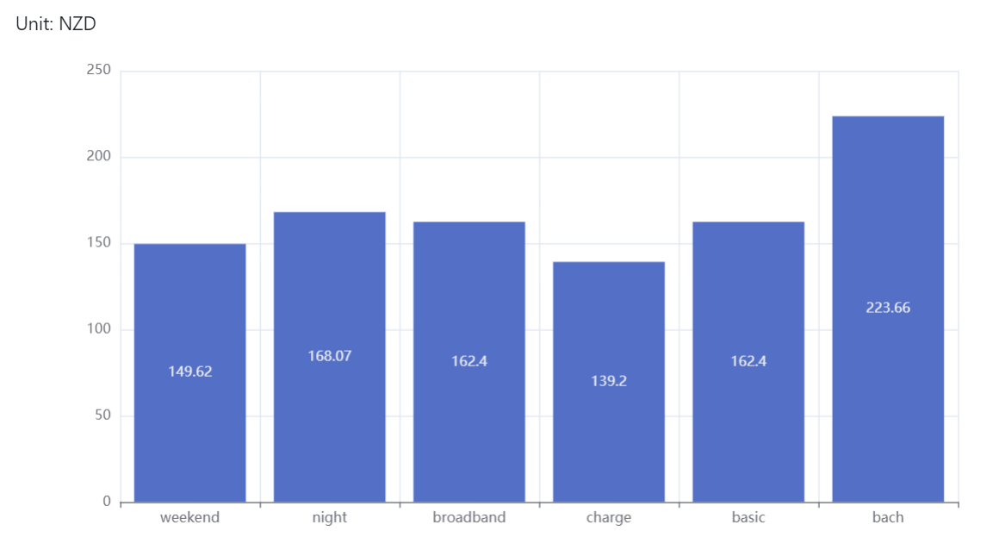
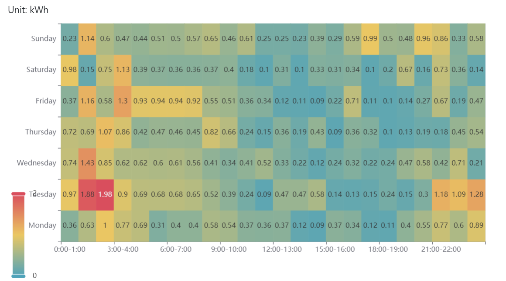

# Contact elec usage
 Calculate electricity usage of Contact Energy account


## Install

Create a Python virtual environment, then run the following command.

```
pip install -r requirements.txt
```

## Usage

Run the following command to start the program.

```
python main.py
```

The program will open a new tab in your system default web browser. Interact with the 
program on that page.

To terminate this program, please close the tab in web browser, then close the command 
line window.

## Screenshots




